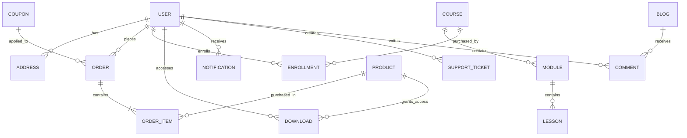

# Kriscap Study Hub

# Database Architecture Documentation v2.0

## Database Engine

PostgreSQL 17+

ORM: Prisma

Design Principles:

* Scalable
* Audit Friendly
* Event Driven
* Analytics Ready
* Secure
* Cloud Native
* Future Subscription Support
* Multi Product Support

---

# High Level Architecture

```text
Frontend (React)

      │

      ▼

Node.js + Express API

      │

      ▼

Prisma ORM

      │

      ▼

PostgreSQL

      │
      ├── User Data
      ├── Orders
      ├── Products
      ├── Learning Content
      ├── Analytics
      ├── Notifications
      ├── CMS
      └── Audit Logs
```

---

# Core Database Domains

The database is divided into domains.

## Identity Domain

Authentication

Authorization

User Profiles

Addresses

Roles

---

## Commerce Domain

Products

Orders

Payments

Coupons

Wishlist

Downloads

---

## Learning Domain

Courses

Classes

Enrollments

Resources

Progress Tracking

---

## Community Domain

Comments

Testimonials

Support Tickets

Announcements

---

## CMS Domain

Blogs

FAQs

Homepage Content

Banners

---

## Analytics Domain

Events

Tracking

Reports

Audit Logs

---

# Entity Relationship Diagram



---

# ENUMS

## Role

```text
USER
ADMIN
SUPER_ADMIN
INSTRUCTOR
SUPPORT
```

---

## ProductType

```text
TMA
PROJECT
NOTE
COURSE
BUNDLE
SERVICE
```

---

## ProductDeliveryType

```text
DIGITAL
PHYSICAL
HYBRID
```

---

## OrderStatus

```text
PENDING
PAID
PROCESSING
SHIPPED
DELIVERED
CANCELLED
REFUNDED
```

---

## PaymentStatus

```text
PENDING
SUCCESS
FAILED
REFUNDED
```

---

## TicketStatus

```text
OPEN
IN_PROGRESS
RESOLVED
CLOSED
```

---

# User Domain

## User

Stores platform users.

```text
id
email
clerkId
role
firstName
lastName
phoneNumber
avatarUrl

isActive
isVerified

createdAt
updatedAt
```

Indexes

```text
email
clerkId
role
```

---

## Address

```text
id
userId

addressLine1
addressLine2

city
state
country

postalCode

isDefault

createdAt
updatedAt
```

---

# Commerce Domain

## Product

Master product catalog.

```text
id

name
slug

description
shortDescription

price
salePrice

type

deliveryType

thumbnail

previewUrl

isFeatured

isActive

stock

ratingAverage
reviewCount

createdAt
updatedAt
```

Indexes

```text
slug
type
isFeatured
isActive
```

---

## Product Metadata

Allows future expansion without schema changes.

```text
id
productId

class
subject
board
medium

customFields JSONB
```

Example:

```json
{
  "class": "12",
  "subject": "Physics",
  "medium": "English"
}
```

---

## Wishlist

```text
id
userId
productId

createdAt
```

---

# Orders

## Order

```text
id

userId

subtotal
discountAmount
taxAmount

shippingCost

grandTotal

status
paymentStatus

couponId

createdAt
updatedAt
```

---

## Order Item

```text
id

orderId
productId

productNameSnapshot

quantity

unitPrice

totalPrice
```

Snapshot fields prevent historical corruption.

---

# Payments

## Payment

```text
id

orderId

gateway

gatewayOrderId

gatewayPaymentId

gatewaySignature

amount

status

paidAt

createdAt
```

Supports:

* Razorpay
* Stripe
* Cashfree
* Future Gateways

---

# Coupon System

## Coupon

```text
id

code

discountType

discountValue

minimumOrder

maximumDiscount

usageLimit

usedCount

validFrom
validUntil

isActive
```

---

# Digital Entitlement System

Critical for scalable digital commerce.

---

## Download

Tracks every digital asset access.

```text
id

userId
productId

orderId

downloadCount

lastDownloadedAt

createdAt
```

Benefits:

* Download Analytics
* Abuse Prevention
* License Management

---

# Learning Domain

## Course

```text
id

title
slug

description

thumbnail

price

isPublished

createdAt
updatedAt
```

---

## Module

```text
id

courseId

title

position
```

---

## Lesson

```text
id

moduleId

title

videoUrl

duration

position
```

---

## Enrollment

```text
id

userId
courseId

progress

completed

enrolledAt
```

---

# Live Classes

## LiveClass

```text
id

title

description

teacherName

meetingUrl

scheduledAt

duration

isCompleted
```

---

## ClassRegistration

```text
id

userId
liveClassId

joined

joinedAt
```

---

# Community Domain

## Comment

```text
id

userId

content

isVisible

createdAt
```

---

## Testimonial

```text
id

userId

message

rating

approved

createdAt
```

---

# Support System

## Support Ticket

```text
id

userId

subject

message

status

priority

assignedAdminId

createdAt
updatedAt
```

---

# CMS Domain

## Blog

```text
id

title

slug

content

featuredImage

published

createdAt
updatedAt
```

---

## FAQ

```text
id

question

answer

sortOrder

isActive
```

---

## Homepage Section

Dynamic homepage management.

```text
id

sectionName

content JSONB

isVisible
```

Examples:

```text
Hero
Testimonials
Statistics
FAQ
```

---

# Notification System

## Notification

```text
id

userId

title

message

isRead

type

createdAt
```

Types:

```text
ORDER
DOWNLOAD
CLASS
PROMOTION
SYSTEM
```

---

# Analytics Domain

## Event Tracking

Stores user actions.

```text
id

userId

eventName

metadata JSONB

createdAt
```

Examples:

```text
PRODUCT_VIEWED

CHECKOUT_STARTED

PURCHASE_COMPLETED

FILE_DOWNLOADED

CLASS_JOINED
```

---

# Audit Logs

Essential for admin accountability.

## AuditLog

```text
id

adminId

action

entityType

entityId

oldData JSONB

newData JSONB

createdAt
```

Example:

```text
Product Updated

Price Changed

Coupon Deleted

User Suspended
```

---

# PostgreSQL Optimization

## Indexes

Create indexes on:

```text
email

clerkId

slug

productId

userId

orderId

createdAt
```

---

## Full Text Search

Use PostgreSQL Full Text Search

For:

* Products
* Blogs
* Courses

---

## JSONB Usage

Store flexible data inside:

```text
ProductMetadata

Analytics Metadata

Homepage Content

Audit Changes
```

Avoid creating unnecessary columns.

---

# File Storage Strategy

Do NOT store files in PostgreSQL.

Store only URLs.

Use:

Cloudinary
AWS S3
R2 Storage

Database stores:

```text
fileUrl

thumbnailUrl

previewUrl
```

---

# Backup Strategy

Daily Automated Backup

Weekly Snapshot

Monthly Archive

Point In Time Recovery Enabled

---

# Scalability Goals

Current Capacity:
10–100 Users

Phase 1:
10,000 Users

Phase 2:
100,000 Users

Phase 3:
1,000,000 Users

This architecture supports:

* Digital Downloads
* Physical Products
* Courses
* Live Classes
* Community Features
* Analytics
* Marketing
* CMS
* Admin Operations

without requiring major database redesigns.
